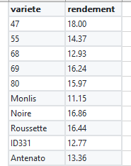

```{r setup, include=FALSE}
knitr::opts_chunk$set(echo = TRUE, fig.pos= "h")
library(ade4)
library(FactoMineR)
library(bookdown)
library(knitr)
library(factoextra)
library(tibble)
```

# Définition du projet

Afin d’appliquer les connaissances acquises lors du module OPEN 2020, nous allons créer une application Shiny à l’aide de R et Rstudio.


Cette application réalisera une analyse statistique de type ANOVA.

Le jeu de données, communiqué par Dylan, comprend des variétés de blés et leurs rendements. Le but est de séparer les variétés en groupe de population en fonction de leur rendement.


Voici ci-dessous un aperçu de ces données :

```{r tableau, echo=FALSE, out.width = '30%', fig.align = "center",fig.cap="Tableau de données utilisé"}

```


# Répartition des rôles

Notre groupe est composé de Anne Pinatel, Anne-Laure Girard, Dylan Clair, Eloise Galmiche, Eugénie Romette, Margot Challand, Salomé Hamard, Thomas Barrande, Valentine Neyret.

* Anne-Laure et Thomas se chargent d’importer les données sous R.

* Margot, Salomé et Dylan réalisent le codage de l’ANOVA.

* Anne et Eugenie ont la charge de la mise en forme dans l’interface shiny.

* Eloise et Valentine réalisent le rapport explicatif du projet et ses étapes. Ce rapport grâce à Word et sera suivi d’un rapport Rmarkdown plus complet.


# Description du code


# Conclusion du module
